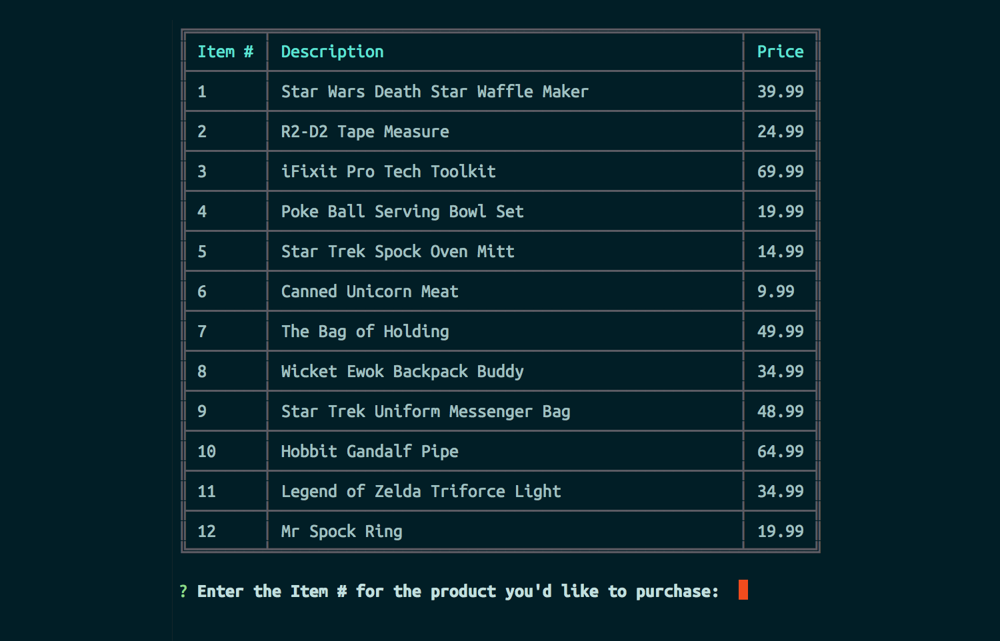

# Bamazon (because CLI shopping is all the rage)

*Bamazon is a CLI storefront utilizing node.js and MySQL where you can outfit your favorite nerd.*
<br>
<br>

<br>
<br>
## [Click here to see Bamazon in Action](https://www.youtube.com/watch?v=das5DuKwzsM)
<br>
## Installation
To install Bamazon, first clone the repo by pasting the following into your Terminal window:
```
  git clone git@github.com:newfoundfreedom/Bamazon.git
  ```
  
Next, Bamazon is dependent on the following NPM packages: [mysql](https://www.npmjs.com/package/mysql), [cli-table](https://www.npmjs.com/package/cli-table), [inquirer](https://www.npmjs.com/package/inquirer) and [chalk](https://www.npmjs.com/package/chalk). You can easily install them by typing the following: 
```
yarn install
```

## Execution
 There are three unique application environments within Bamazon. **Customer**, **Manager** & **Supervisor**. 
 They can be run with one of the following three commands:
 ```
 node bamazonCustomer.js
 ```
 ```
 node bamazonManager.js
 ```
 ```
 node bamazonSupervisor.js
 ```
  
  <br>
  

